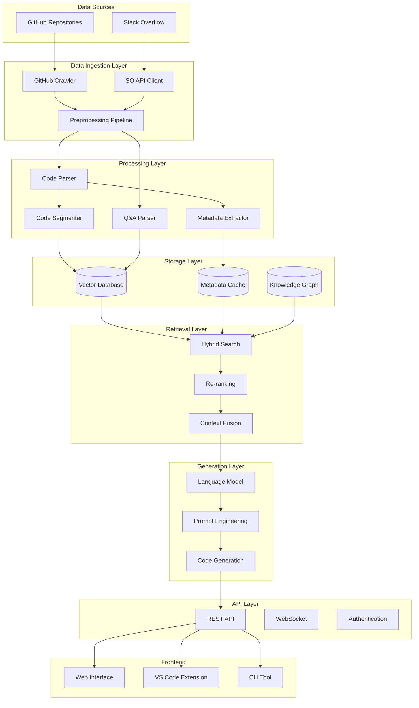

# Python Code Helper RAG System

A production-grade Retrieval-Augmented Generation (RAG) system that provides intelligent Python coding assistance by leveraging GitHub repositories and Stack Overflow data.

## 🏗️ Architecture Overview



## 🚀 Features

- **Intelligent Code Search**: Hybrid search combining semantic and keyword-based retrieval
- **Multi-Source Knowledge**: Integrates GitHub repositories and Stack Overflow Q&As
- **Advanced Code Parsing**: AST-based Python code analysis and semantic chunking
- **Production-Ready**: Clean architecture, comprehensive error handling, and monitoring
- **Scalable Design**: Async operations, caching, and horizontal scaling support
- **Real-time Responses**: Streaming API endpoints for better user experience
- **Quality Assurance**: RAGAS evaluation metrics and continuous monitoring

## 📋 Implementation Phases

> 📖 **Detailed Documentation**: See [PHASES_COMPLETED.md](./PHASES_COMPLETED.md) for comprehensive technical documentation of completed phases, including architecture details, code examples, and implementation insights.

### ✅ Phase 1: Project Setup & Foundation - **COMPLETED**
- [x] Project structure setup with clean architecture
- [x] Pydantic-based configuration management with validation
- [x] Structured logging with contextual information
- [x] Comprehensive testing framework with coverage
- [x] Async utilities and text processing tools
- [x] Development environment with quality tools

### ✅ Phase 2: Data Ingestion Infrastructure - **COMPLETED**
- [x] Abstract base collector framework for extensibility
- [x] GitHub repository crawler with intelligent filtering
- [x] Stack Overflow Q&A collector with API integration
- [x] Async data pipeline with concurrent processing
- [x] Comprehensive error handling and retry logic
- [x] Health monitoring and performance metrics

**Key Achievements:**
- **Production-ready collectors** with rate limiting and error recovery
- **26 unit tests** with 44% overall coverage (85%+ for core components)
- **Async pipeline orchestrator** supporting concurrent data collection
- **Rich metadata extraction** for code analysis and Q&A processing
- **Clean architecture** following SOLID principles and best practices

### Phase 3: Data Processing & Chunking (Week 5-6)
- [ ] Advanced Python code parser
- [ ] Semantic chunking strategy
- [ ] Metadata extraction
- [ ] Content preprocessing pipeline

### Phase 4: Vector Storage & Indexing (Week 7-8)
- [ ] Pinecone vector database setup
- [ ] Embedding generation pipeline
- [ ] Hybrid search implementation
- [ ] Search result ranking

### Phase 5: Generation & LLM Integration (Week 9-10)
- [ ] OpenAI API integration
- [ ] Advanced prompt engineering
- [ ] Streaming response generation
- [ ] Context management

### Phase 6: API Layer & Services (Week 11-12)
- [ ] FastAPI application
- [ ] REST and WebSocket endpoints
- [ ] Authentication and rate limiting
- [ ] Background task processing

### Phase 7: Evaluation & Monitoring (Week 13-14)
- [ ] RAGAS evaluation implementation
- [ ] Prometheus metrics collection
- [ ] Performance monitoring dashboard
- [ ] A/B testing framework

### Phase 8: Frontend Development (Week 15-16)
- [ ] React web interface
- [ ] VS Code extension (optional)
- [ ] CLI tool
- [ ] User feedback system

### Phase 9: Deployment & DevOps (Week 17-18)
- [ ] Docker containerization
- [ ] Kubernetes deployment
- [ ] CI/CD pipeline
- [ ] Production monitoring

## 🛠️ Technology Stack

### Core Technologies
- **Backend**: Python 3.11+, FastAPI, Uvicorn
- **Vector Database**: Pinecone
- **LLM**: OpenAI GPT-4 Turbo
- **Embeddings**: Sentence Transformers (all-MiniLM-L6-v2)
- **Search**: Hybrid (semantic + BM25)

### Data Sources
- **GitHub API**: Repository code extraction
- **Stack Overflow API**: Q&A data collection
- **AST Parser**: Python code analysis

### Infrastructure
- **Containerization**: Docker, Docker Compose
- **Orchestration**: Kubernetes
- **Monitoring**: Prometheus, Grafana
- **Caching**: Redis
- **CI/CD**: GitHub Actions

### Frontend
- **Web UI**: React, TypeScript, Material-UI
- **Editor Extension**: VS Code API
- **CLI**: Click, Rich

## 📁 Project Structure

```
python-code-helper/
├── src/
│   ├── ingestion/           # Data collection modules
│   │   ├── __init__.py
│   │   ├── github_crawler.py
│   │   ├── stackoverflow_collector.py
│   │   └── base_collector.py
│   ├── processing/          # Data processing pipeline
│   │   ├── __init__.py
│   │   ├── code_parser.py
│   │   ├── chunker.py
│   │   └── metadata_extractor.py
│   ├── storage/            # Vector database operations
│   │   ├── __init__.py
│   │   ├── vector_store.py
│   │   └── cache_manager.py
│   ├── retrieval/          # Search and retrieval
│   │   ├── __init__.py
│   │   ├── hybrid_search.py
│   │   └── reranker.py
│   ├── generation/         # LLM integration
│   │   ├── __init__.py
│   │   ├── code_generator.py
│   │   ├── prompt_templates.py
│   │   └── response_formatter.py
│   ├── api/               # FastAPI application
│   │   ├── __init__.py
│   │   ├── main.py
│   │   ├── endpoints/
│   │   └── middleware/
│   ├── evaluation/        # Testing and metrics
│   │   ├── __init__.py
│   │   ├── rag_evaluator.py
│   │   └── test_cases.py
│   ├── monitoring/        # Metrics and logging
│   │   ├── __init__.py
│   │   ├── metrics_collector.py
│   │   └── logger.py
│   ├── config/           # Configuration management
│   │   ├── __init__.py
│   │   └── settings.py
│   └── utils/            # Utility functions
│       ├── __init__.py
│       ├── async_utils.py
│       └── text_utils.py
├── tests/                # Test suite
│   ├── unit/
│   ├── integration/
│   └── e2e/
├── frontend/             # Web interface
│   ├── src/
│   ├── public/
│   └── package.json
├── scripts/              # Deployment and utility scripts
│   ├── setup.sh
│   ├── deploy.sh
│   └── data_migration.py
├── docker/              # Docker configurations
│   ├── Dockerfile
│   ├── docker-compose.yml
│   └── docker-compose.prod.yml
├── k8s/                 # Kubernetes manifests
│   ├── deployment.yaml
│   ├── service.yaml
│   └── ingress.yaml
├── monitoring/          # Monitoring configs
│   ├── prometheus.yml
│   └── grafana/
├── docs/               # Documentation
│   ├── api.md
│   ├── deployment.md
│   └── contributing.md
├── .github/            # GitHub Actions
│   └── workflows/
├── requirements.txt    # Python dependencies
├── pyproject.toml     # Project configuration
├── .env.template      # Environment variables template
├── .gitignore
└── README.md
```

## 🚀 Quick Start

### Prerequisites

- Python 3.11+
- Node.js 18+ (for frontend)
- Docker and Docker Compose
- Git

### Environment Setup

1. **Clone the repository**
```bash
git clone https://github.com/your-org/python-code-helper.git
cd python-code-helper
```

2. **Create virtual environment**
```bash
python -m venv venv
source venv/bin/activate  # On Windows: venv\Scripts\activate
```

3. **Install dependencies**
```bash
pip install -r requirements.txt
```

4. **Set up environment variables**
```bash
cp .env.template .env
# Edit .env with your API keys and configuration
```

5. **Run the application**
```bash
# Development mode
uvicorn src.api.main:app --reload --host 0.0.0.0 --port 8000

# Or using Docker Compose
docker-compose up -d
```

### Required Environment Variables

```bash
# API Keys
OPENAI_API_KEY=your_openai_api_key
GITHUB_TOKEN=your_github_token
PINECONE_API_KEY=your_pinecone_api_key
STACKOVERFLOW_API_KEY=your_so_api_key  # Optional

# Database Configuration
PINECONE_ENVIRONMENT=us-east-1-aws
PINECONE_INDEX_NAME=python-code-helper

# Model Configuration
EMBEDDING_MODEL=all-MiniLM-L6-v2
LLM_MODEL=gpt-4-turbo-preview

# Processing Configuration
CHUNK_SIZE=1000
CHUNK_OVERLAP=200
MAX_TOKENS=4000

# Server Configuration
HOST=0.0.0.0
PORT=8000
LOG_LEVEL=INFO
```

## 📖 API Documentation

### Main Endpoints

#### Query Code Helper
```http
POST /api/query
Content-Type: application/json

{
  "query": "How do I implement a binary search tree in Python?",
  "response_type": "code_explanation",
  "max_results": 10,
  "include_sources": true
}
```

#### Streaming Response
```http
POST /api/query/stream
Content-Type: application/json

{
  "query": "Explain Python decorators with examples",
  "response_type": "code_explanation"
}
```

#### Start Data Indexing
```http
POST /api/index
Content-Type: application/json

{
  "repositories": ["python/cpython", "django/django"],
  "stackoverflow_tags": ["python", "django"],
  "max_repos": 50,
  "max_so_posts": 1000
}
```

## 🧪 Testing

### Run Tests
```bash
# Unit tests
pytest tests/unit/ -v

# Integration tests
pytest tests/integration/ -v

# End-to-end tests
pytest tests/e2e/ -v

# All tests with coverage
pytest --cov=src --cov-report=html
```

### Evaluation Metrics
```bash
# Run RAGAS evaluation
python scripts/evaluate_rag.py --test-file tests/evaluation_dataset.json

# Performance benchmarks
python scripts/benchmark.py --queries 100 --concurrent-users 10
```

## 📊 Monitoring

### Metrics Dashboard
- **Prometheus**: `http://localhost:9090`
- **Grafana**: `http://localhost:3001` (admin/admin)

### Key Metrics
- Query response time
- Confidence scores
- User feedback ratings
- Search accuracy
- System resource usage

## 🐳 Deployment

### Docker Deployment
```bash
# Build and run
docker-compose up -d

# Scale services
docker-compose up -d --scale api=3
```

### Kubernetes Deployment
```bash
# Apply manifests
kubectl apply -f k8s/

# Check deployment
kubectl get pods -l app=python-code-helper
```

### Production Considerations
- Use managed vector databases (Pinecone Pro)
- Implement proper load balancing
- Set up SSL/TLS certificates
- Configure backup and disaster recovery
- Monitor resource usage and costs

## 🤝 Contributing

1. Fork the repository
2. Create a feature branch (`git checkout -b feature/amazing-feature`)
3. Commit your changes (`git commit -m 'Add amazing feature'`)
4. Push to the branch (`git push origin feature/amazing-feature`)
5. Open a Pull Request

### Development Guidelines
- Follow PEP 8 style guidelines
- Add comprehensive type hints
- Write unit tests for new features
- Update documentation as needed
- Use conventional commit messages

## 📝 License

This project is licensed under the MIT License - see the [LICENSE](LICENSE) file for details.

## 🙏 Acknowledgments

- OpenAI for GPT-4 API
- Pinecone for vector database
- LangChain community for RAG patterns
- GitHub and Stack Overflow for data sources

## 📞 Support

- **Documentation**: [docs/](docs/)
- **Issues**: [GitHub Issues](https://github.com/your-org/python-code-helper/issues)
- **Discussions**: [GitHub Discussions](https://github.com/your-org/python-code-helper/discussions)

---

**Built with ❤️ by the Python Code Helper Team** 